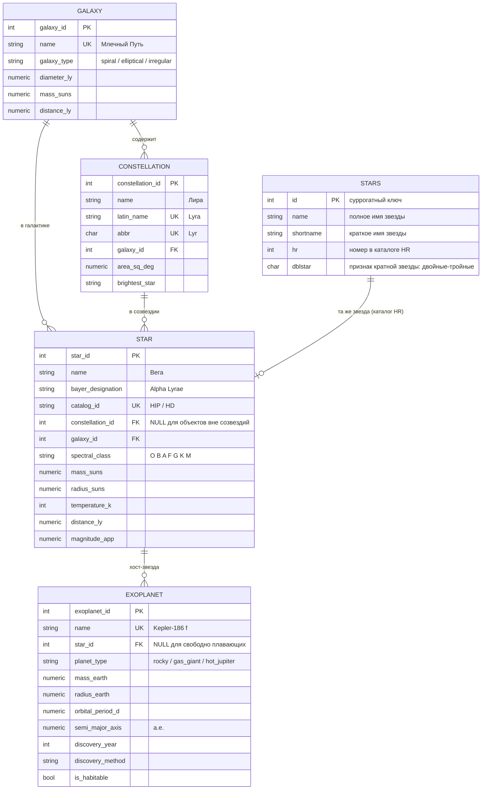

# sql2text
генерация QWEN=coder 3.5


## Схема БД: Звёзды (stars) · Созвездия · Экзопланеты · Галактики

Реляционная схема в файле [`schema.sql`](./schema.sql) — **PostgreSQL 14+** (проверено на PostgreSQL 15: скрипт выполняется без ошибок).

Использованы возможности именно PostgreSQL: `GENERATED ALWAYS AS IDENTITY`, `ENUM`-типы, `TIMESTAMPTZ`, `NUMERIC`, массивы `TEXT[]`, регулярный `CHECK` (`~`), частичный индекс (`WHERE is_habitable`), GIN-индекс по массиву, триггер `BEFORE UPDATE ... EXECUTE FUNCTION` для `updated_at`, plpgsql-функция.

### Как запустить
```bash
createdb astro_db
psql -d astro_db -v ON_ERROR_STOP=1 -f schema.sql
# или через Docker:
docker run -d --name pg-astro -e POSTGRES_PASSWORD=pass -p 5432:5432 postgres:16
docker exec -i pg-astro psql -U postgres -c "CREATE DATABASE astro_db"
docker exec -i pg-astro psql -U postgres -d astro_db < schema.sql
```

### ER-диаграмма



### Текстовая иерархия связей

```
galaxy (галактика)
  └── constellation (созвездие)           N:1 — созвездие наблюдается в галактике
        └── star (звезда)                 N:1 — звезда принадлежит созвездию
              └── exoplanet (экзопланета) N:1 — планета обращается вокруг звезды
star → galaxy                             N:1 — прямая ссылка на галактику
stars (каталог HR)                        независимая справочная таблица звёзд
```

Кардинальность:
* одна **галактика** → много **созвездий** и **звёзд**;
* одно **созвездие** → много **звёзд**;
* одна **звезда** → много **экзопланет**;
* экзопланета без хоста (`star_id = NULL`) — свободно плавающая планета;
* звезда без созвездия (`constellation_id = NULL`) допустима.

### Таблица `stars` — каталог звёзд (HR)

Упрощённая справочная таблица звёзд, дополняющая основную схему:

| Поле | Тип | Описание |
|---|---|---|
| `id` | `SERIAL PRIMARY KEY` | суррогатный ключ |
| `name` | `TEXT` | полное имя звезды |
| `shortname` | `TEXT` | краткое имя звезды |
| `hr` | `INTEGER` | номер звезды в каталоге HR (Harvard Revised) |
| `dblstar` | `CHAR(1)` | признак кратной звезды: двойные–тройные системы |

Примеры значений `dblstar`: `D` — двойная, `T` — тройная, `NULL` — одиночная.

Связь с таблицей `star` устанавливается по номеру каталога: `stars.hr` ↔ идентификатор звезды в каталоге HR (явного внешнего ключа нет — таблицы живут независимо).

### Ключевые решения

| Решение | Обоснование |
|---|---|
| `ON DELETE RESTRICT` для galaxy | нельзя удалить галактику, пока в ней есть объекты |
| `ON DELETE SET NULL` для constellation у звезды | созвездие — условная проекция на небесную сферу |
| `ON DELETE CASCADE` для star → exoplanet | планеты существуют только вместе со своей звездой |
| `CHECK (spectral_class ~ '^[OBAFGKMLWT][0-9]')` | валидация спектрального класса |
| Частичный индекс `WHERE is_habitable` | быстрый поиск обитаемых планет |
| Представление `v_planet_full_info` | готовая цепочка планета → звезда → созвездие → галактика |

### Примеры запросов

Все экзопланеты одного созвездия с их звёздами:

```sql
SELECT c.name AS constellation, s.name AS star, ep.name AS planet
FROM exoplanet ep
JOIN star s ON s.star_id = ep.star_id
JOIN constellation c ON c.constellation_id = s.constellation_id
WHERE c.latin_name = 'Cygnus';
```

Количество подтверждённых планет по типам звёзд:

```sql
SELECT LEFT(s.spectral_class, 1) AS spectral_type, COUNT(*) AS planets
FROM exoplanet ep JOIN star s USING (star_id)
GROUP BY 1 ORDER BY 2 DESC;
```
